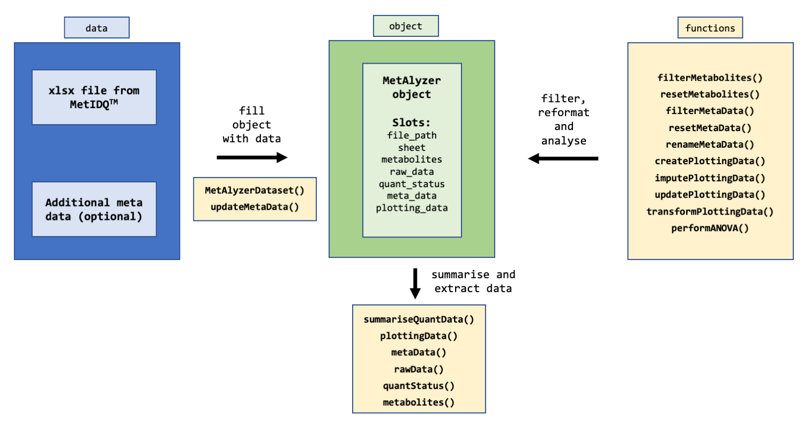
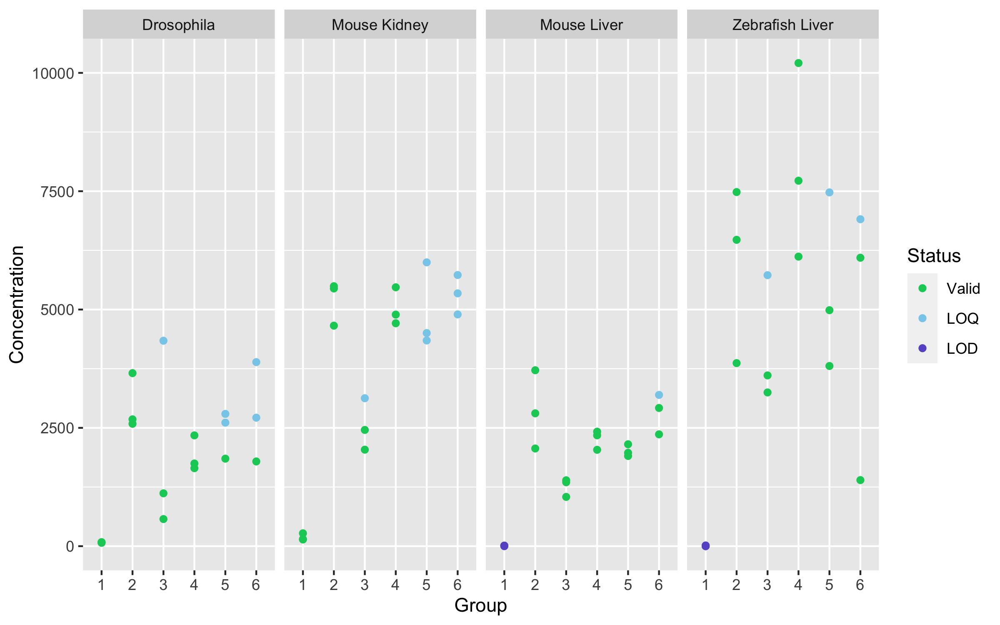

MetAlyzer
========

<!-- badges: start -->
[](https://github.com/andresenc/MetAlyzer/actions)
[](https://www.gnu.org/licenses/gpl-3.0.en.html)
<!-- badges: end -->

**An R Package to read and analyze MetIDQ&trade; output**

The package provides methods to read output files from the MetIDQ&trade; software into R. Metabolomics data is read and reformatted into an S4 object for convenient data handling, statistics and downstream analysis.

## Install

There is a version available on CRAN.

```r
install.packages("MetAlyzer")
```

## Quick start



The package takes metabolomic measurements and the quantification status (e.g. "Valid", "LOQ", "LOD") as ".xlsx" files generated from the MetIDQ&trade; software. Additionally, meta data for each sample can be provided for further analysis.

#### Set data path and read meta data
```r
fpath <- system.file("extdata", "example_data.xlsx", package = "MetAlyzer")
mpath <- system.file("extdata", "example_meta_data.rds", package = "MetAlyzer")
```

#### Create MetAlyzer object:
```r
obj <- MetAlyzerDataset(file_path = fpath)
```

#### Show MetAlyzer object:
```r
show(obj)
-------------------------------------
File name: example_data.xlsx 
Sheet: 1 
File path: /Library/Frameworks/R.framework/Versions/4.0/Resources/library/MetAlyzer/extdata 
Metabolites: 862 
Classes: 24 
Including metabolism indicators: TRUE 
Number of samples: 74 
Columns meta data: "Plate Bar Code"; "Sample Bar Code"; "Sample Type"; "Group"; "Tissue"; "Sample Volume"; "Measurement Time"
Ploting data created: FALSE
```

#### Use filter functions to exclude the metabolite indicators and only keep Group 1 to 6:
```r
obj <- filterMetabolites(obj, class_name = "Metabolism Indicators")
232 metabolites were filtered!
obj <- filterMetaData(obj, column = Group, keep = c(1:6))
```

#### Show statistics:
```r
summariseQuantData(obj)
-------------------------------------
Valid: 21951 (48.39%)
LOQ: 2832 (6.24%)
LOD: 20577 (45.36%)
NAs: 0 (0%)
```

#### Add meta data:
```r
meta_df <- readRDS(mpath)
obj <- updateMetaData(obj, Replicate, meta_df$Replicate)
```

#### Reformat for plotting:
For further filtering and plotting, the data can be reformatted into a data frame.
```{r}
obj <- createPlottingData(obj, Group, Tissue, ungrouped = Replicate)
gg_df <- plottingData(obj)

head(gg_df)
# A tibble: 6 × 12
# Groups:   Group, Tissue, Metabolite [2]
  Group Tissue     Replicate Metabolite Class         Concentration  Mean    SD    CV CV_thresh Status
  <fct> <fct>      <fct>     <fct>      <fct>                 <dbl> <dbl> <dbl> <dbl> <fct>     <fct> 
1 1     Drosophila R1        C0         Acylcarnitin…         203   179.  82.4  0.461 more30    Valid 
2 1     Drosophila R2        C0         Acylcarnitin…          86.8 179.  82.4  0.461 more30    Valid 
3 1     Drosophila R3        C0         Acylcarnitin…         246   179.  82.4  0.461 more30    Valid 
4 1     Drosophila R1        C2         Acylcarnitin…          29.5  26.6  9.72 0.365 more30    Valid 
5 1     Drosophila R2        C2         Acylcarnitin…          15.8  26.6  9.72 0.365 more30    Valid 
6 1     Drosophila R3        C2         Acylcarnitin…          34.6  26.6  9.72 0.365 more30    Valid 
# … with 1 more variable: valid_replicates <lgl>
```

#### Plot filter data and plot concentration of glutamic acid:
```{r}
glu_gg_df <- filter(gg_df, Metabolite == "Glu")

ggplot(glu_gg_df, aes(Group, Concentration, color = Status)) +
  geom_point() +
  scale_color_manual(values = c("Valid" = "#00CD66",
                                "LOQ" = "#87CEEB",
                                "LOD" = "#6A5ACD")) + 
  facet_grid(~ Tissue)
```



## Detailed instructions
**For a comprehensive tutorial, please check out the vignette.**
