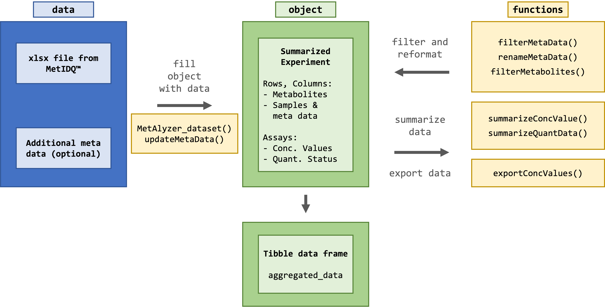
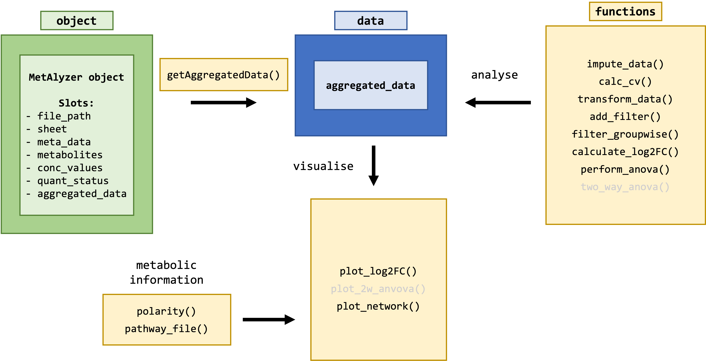

MetAlyzer
========

<!-- badges: start -->
[](https://github.com/andresenc/MetAlyzer/actions)
[](https://www.gnu.org/licenses/gpl-3.0.en.html)
[](https://cran.r-project.org/package=MetAlyzer)
<!-- badges: end -->

**An R Package to read and analyze MetIDQ&trade; output**

The package provides methods to read output files from the MetIDQ&trade; software into R. Metabolomics data is read and reformatted into an S4 object for convenient data handling, statistics and downstream analysis.

## Install

There is a version available on CRAN.

```r
install.packages("MetAlyzer")
```

For the latest version install from GitHub
```r
library(devtools)
install_github("nilsmechtel/MetAlyzer")
```

## Quickstart

The package takes metabolomic measurements and the quantification status (e.g. "Valid", "LOQ", "LOD") as ".xlsx" files generated from the MetIDQ&trade; software. Additionally, meta data for each sample can be provided for further analysis.



This is an extract from one of the provided example data sets.


#### Create MetAlyzer object:
```r
> metalyzer <- MetAlyzer_dataset(file_path = extraction_data())
> show(metalyzer)
-------------------------------------
File name: extraction_data.xlsx
Sheet: 1 
File path: /Library/Frameworks/R.framework/Versions/4.0/Resources/library/MetAlyzer/extdata 
Metabolites: 862 
Classes: 24 
Including metabolism indicators: TRUE 
Number of samples: 74 
Columns meta data: "Plate Bar Code"; "Sample Bar Code"; "Sample Type"; "Sample Description"; "Tissue"; "Sample Volume"; "Measurement Time"
Aggregated data available:  FALSE
-------------------------------------
```

#### Show statistics:
```r
> na_metabolites <- summariseConcValues(metalyzer)
-------------------------------------
Quantiles:
        0%        25%        50%        75%       100% 
     0.000      0.028      1.960     22.700 288149.000 

NAs: 4941 (7.96%)
-------------------------------------
```

```r
> status_list <- summariseQuantData(metalyzer)
-------------------------------------
Valid: 24056 (38.76%)
LOQ: 5790 (9.33%)
LOD: 20577 (33.15%)
Invalid: 11641 (18.76%)
NAs: 0 (0%)
-------------------------------------
```

### Downstream analysis:
For further filtering, statistical analysis and plotting, the data can be reformatted and aggregated into a tibble data frame.



```{r}
> renameMetaData(metalyzer, Method = `Sample Description`)
> filterMetaData(metalyzer, !is.na(Tissue))
> aggregated_data <- aggregateData(metalyzer, Tissue, Method)
> aggregated_data
# A tibble: 62,064 × 8
# Groups:   Tissue, Method, Metabolite [20,688]
   ID    Tissue    Method Metabolite Class Concentration Status Valid_Replicates
   <fct> <fct>     <fct>  <fct>      <fct>         <dbl> <fct>  <lgl>           
 1 9     Drosophi… 1      C0         Acyl…       203     Valid  TRUE            
 2 10    Drosophi… 1      C0         Acyl…        86.8   Valid  TRUE            
 3 11    Drosophi… 1      C0         Acyl…       246     Valid  TRUE            
 4 9     Drosophi… 1      C2         Acyl…        29.5   Valid  TRUE            
 5 10    Drosophi… 1      C2         Acyl…        15.8   Valid  TRUE            
 6 11    Drosophi… 1      C2         Acyl…        34.6   Valid  TRUE            
 7 9     Drosophi… 1      C3         Acyl…        39.2   Valid  TRUE            
 8 10    Drosophi… 1      C3         Acyl…         9.29  Valid  TRUE            
 9 11    Drosophi… 1      C3         Acyl…        49.9   Valid  TRUE            
10 9     Drosophi… 1      C3-DC (C4… Acyl…         0.057 LOD    FALSE           
# ℹ 62,054 more rows
# ℹ Use `print(n = ...)` to see more rows
```

## Detailed instructions
**For a comprehensive tutorial, please check out the vignette (\<Link_to_User_Manual>).**
