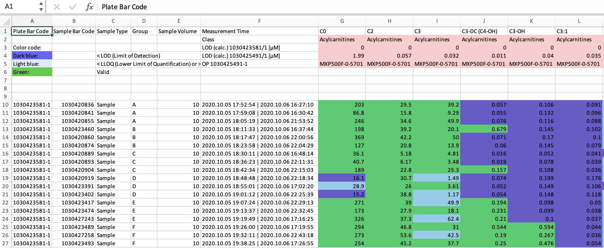

MetAlyzer
========

<!-- badges: start -->
[](https://github.com/nilsmechtel/MetAlyzer/actions/workflows/R-CMD-check.yaml)
[](https://www.gnu.org/licenses/gpl-3.0.en.html)
[](https://cran.r-project.org/package=MetAlyzer)
<!-- badges: end -->

**An R Package to read and analyze MetIDQ&trade; output**

The package provides methods to read output files from the MetIDQ&trade; software into R. Metabolomics data is read and reformatted into an S4 object for convenient data handling, statistics and downstream analysis.

## Install

There is a version available on CRAN.

```r
install.packages("MetAlyzer")
```

For the latest version install from GitHub
```r
library(devtools)
install_github("nilsmechtel/MetAlyzer")
```

## Quickstart

The package takes metabolomic measurements and the quantification status (e.g. "Valid", "LOQ", "LOD") as ".xlsx" files generated from the MetIDQ&trade; software. Additionally, meta data for each sample can be provided for further analysis.


This is an extract from one of the provided example data sets.


#### Create MetAlyzer object:
```{r}
> metalyzer_se <- MetAlyzer_dataset(file_path = extraction_data())


 _____ ______   _______  _________  ________  ___           ___    ___ ________  _______   ________
|\   _ \  _   \|\  ___ \|\___   ___\\   __  \|\  \         |\  \  /  /|\_____  \|\  ___ \ |\   __  \
\ \  \\\__\ \  \ \   __/\|___ \  \_\ \  \|\  \ \  \        \ \  \/  / /\|___/  /\ \   __/|\ \  \|\  \
 \ \  \\|__| \  \ \  \_|/__  \ \  \ \ \   __  \ \  \        \ \    / /     /  / /\ \  \_|/_\ \   _  _\
  \ \  \    \ \  \ \  \_|\ \  \ \  \ \ \  \ \  \ \  \____    \/   / /     /  /_/__\ \  \_|\ \ \  \\  \| 
   \ \__\    \ \__\ \_______\  \ \__\ \ \__\ \__\ \_______\__/   / /     |\________\ \_______\ \__\\ _\ 
    \|__|     \|__|\|_______|   \|__|  \|__|\|__|\|_______|\____/ /       \|_______|\|_______|\|__|\|__|
                                                          \|____|/


Info: Reading color code "FFFFCCCC" as "#FFCCCC"
Info: Reading color code "FF00CD66" as "#00CD66"
Info: Reading color code "FF6A5ACD" as "#6A5ACD"
Info: Reading color code "FF87CEEB" as "#87CEEB"
Info: Reading color code "FFFFFFCC" as "#FFFFCC"

Measured concentration values:
------------------------------
        0%        25%        50%        75%       100% 
     0.000      0.017      1.760     21.200 288149.000 

NAs: 5348 (8.38%)
Note: 'Metabolism Indicators' are frequently NA!

Measured quantification status:
-------------------------------
Valid: 24095 (37.77%)
LOQ: 5799 (9.09%)
LOD: 21789 (34.16%)
Invalid: 12105 (18.98%)
NAs: 0 (0%)
```

### Downstream analysis:
For further filtering, statistical analysis and plotting, the data is reformatted and aggregated into a tibble data frame.

```{r}
> aggregatedData(metalyzer_se)
# A tibble: 63,788 × 5
# Groups:   Metabolite [862]
   ID    Metabolite Class          Concentration Status
   <fct> <fct>      <fct>                  <dbl> <fct> 
 1 9     C0         Acylcarnitines         203   Valid 
 2 10    C0         Acylcarnitines          86.8 Valid 
 3 11    C0         Acylcarnitines         246   Valid 
 4 12    C0         Acylcarnitines         198   Valid 
 5 13    C0         Acylcarnitines         369   Valid 
 6 14    C0         Acylcarnitines         127   Valid 
 7 15    C0         Acylcarnitines          36.1 Valid 
 8 16    C0         Acylcarnitines          40.7 Valid 
 9 17    C0         Acylcarnitines         189   Valid 
10 18    C0         Acylcarnitines          16.1 LOD   
# ℹ 63,778 more rows
# ℹ Use `print(n = ...)` to see more rows
```

## Detailed instructions
**For a comprehensive tutorial, please check out the [MetAlyzer User Guide](https://github.com/nilsmechtel/MetAlyzer/blob/main/vignettes/MetAlyzer_User_Guide.html).**
